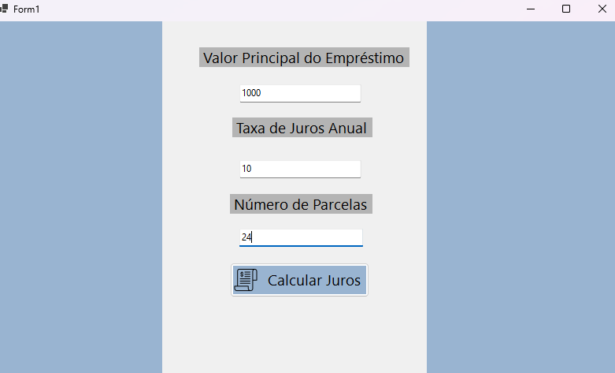

<h1 align="center">Calculadora de Juros</h1>

### Tecnologias Utilizadas:
* C#
* Windows Forms

### Ferramentas Utilizadas:
* Microsoft Visual Studio

### Funções do Software:
* A aplicação fornece uma interface de usuário (GUI) simples para inserir os valores.
* Permite que o usuário insira os valores do financiamento e clique em um botão para calcular os juros.
* O resultado é exibido na interface do usuário, incluindo o valor total a ser pago e o valor total dos juros.

  ### Telas do Forms:

<figure>
  
</figure>

<figure>
  
</figure>

